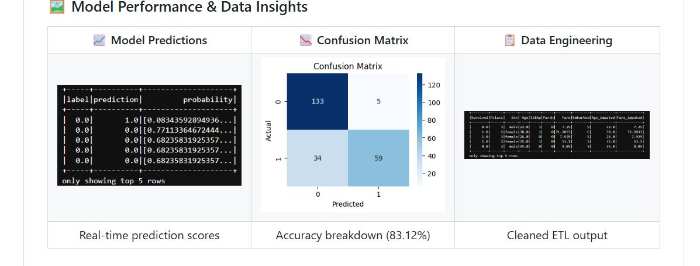

# Scalable Health Data Solutions: PySpark ML Pipeline & GCP Cloud Strategy

A two-part project combining hands-on distributed machine learning with a strategic cloud architecture proposal for healthcare analytics. Part one demonstrates a full PySpark MLlib pipeline using a benchmark classification dataset. Part two applies that same technical approach to a real-world healthcare problem - designing a scalable GCP architecture for real-time patient monitoring and early disease detection.

---

## Why This Structure

Building a machine learning pipeline and deploying it in a production healthcare environment are two different problems. Most projects show one or the other. This project addresses both - first proving the technical pipeline works at scale using a well-understood benchmark dataset, then mapping that same architecture to the constraints and compliance requirements of a clinical setting. The result is a portfolio piece that demonstrates not just coding ability but the ability to think about data engineering end-to-end.

---

## Part 1 - Technical Pipeline: PySpark ML with MLlib

### The Dataset

The Titanic Extended dataset from Kaggle was used as the benchmark for this pipeline. It is a well-understood binary classification problem with mixed data types - numerical, categorical, and missing values - making it a practical testbed for a production-grade feature engineering workflow. The goal was not to build the best Titanic model; it was to build a pipeline structure that could be applied to any large-scale classification problem, including clinical risk prediction.

| | |
|---|---|
| Dataset | [Titanic Extended - Kaggle](https://www.kaggle.com/datasets/pavlofesenko/titanic-extended) |
| Primary Task | Binary Classification (survival prediction) |
| Secondary Task | Regression (fare prediction) |
| Framework | Apache Spark MLlib, PySpark |
| Environment | Google Colab |

---

### Feature Engineering Pipeline

The pipeline was built modularly using Spark ML's Pipeline API so that each transformation step is reusable and the entire workflow can be retrained on new data without rewriting code. This is the same pattern used in production ML systems.

**Handling missing values.** Age and Fare contained null values. Rather than dropping rows, an Imputer was applied to replace nulls with column medians - a standard approach that preserves sample size without introducing bias from mean imputation on skewed distributions.

**Encoding categorical variables.** Sex, Embarked, and Pclass were string columns that needed to be converted for Spark's ML algorithms. StringIndexer converted each to numeric indices, followed by OneHotEncoder to create binary vector representations. This prevents the model from treating ordinal relationships as meaningful where none exist.

**Feature assembly.** All processed columns were combined into a single feature vector using VectorAssembler, which is required by Spark MLlib's algorithm interface.

```python
imputer = Imputer(inputCols=["Age", "Fare"], outputCols=["Age_imputed", "Fare_imputed"])
indexers = [StringIndexer(inputCol=col, outputCol=col + "_Index") for col in ["Sex", "Embarked", "Pclass"]]
encoders = [OneHotEncoder(inputCol=col + "_Index", outputCol=col + "_Vec") for col in ["Sex", "Embarked", "Pclass"]]
assembler = VectorAssembler(
    inputCols=["Age_imputed", "SibSp", "Parch", "Sex_Vec", "Embarked_Vec", "Pclass_Vec"],
    outputCol="features"
)
```

---

### Model Results

<p align="center">
  
</p>

*Left: Real-time prediction scores with probability estimates. Center: Confusion matrix showing 133 true negatives and 59 true positives at 83.12% accuracy. Right: Cleaned ETL output after imputation and feature engineering.*

**Random Forest Classifier - Survival Prediction**

| Metric | Result |
|---|---|
| Accuracy | 83.12% |
| F1-Score | 0.8236 |
| True Negatives | 133 |
| True Positives | 59 |
| False Positives | 5 |
| False Negatives | 34 |

The false negative rate - 34 cases where the model predicted survival but the passenger did not survive - is the more clinically relevant error type in a healthcare context. In a patient risk scoring application, a false negative (predicting low risk when risk is high) carries a higher cost than a false positive. This informed the evaluation strategy for Part 2.

**Linear Regression - Fare Prediction**

| Metric | Result |
|---|---|
| RMSE | 40.75 |
| R-Squared | 0.40 |

The regression model's R² of 0.40 indicates moderate predictive power. Fare is a noisy target with high variance, and the model captures roughly 40% of that variance with the available features. In a healthcare application, this regression approach would be applied to treatment cost prediction, where additional clinical features would substantially improve the R².

---

## Part 2 - Strategic Application: GCP Architecture for Healthcare

### The Business Problem

Early disease detection is one of the highest-value problems in modern healthcare. Diagnosis typically happens after symptoms appear - by which point intervention is more costly, more invasive, and less effective. Continuous monitoring of patient vitals through wearable devices generates a stream of data that, if processed in real time, can surface warning signals before a patient deteriorates.

The challenge is scale. A regional hospital network monitoring 50,000 patients continuously generates millions of data points per day. The data is heterogeneous - physiological readings, behavioral signals, and patient-reported outcomes. And it is subject to strict regulatory requirements under HIPAA. No traditional on-premise system handles all three constraints simultaneously.

### Proposed GCP Architecture

The following GCP services were selected based on their specific fit to this problem - not as a generic cloud stack.

**BigQuery** serves as the central data warehouse, integrating streaming patient event data with historical Electronic Health Records (EHRs). Its serverless architecture means no infrastructure management and cost scales with query volume rather than reserved capacity. For a healthcare organization, this eliminates the need for a dedicated DBA team to maintain the analytical layer.

**Cloud Dataflow** handles the real-time stream processing layer, consuming wearable device events, applying transformation logic, and triggering anomaly alerts when vital signs cross clinical thresholds. It uses the Apache Beam programming model, which means the same pipeline code runs in both batch and streaming mode - useful for backfilling historical data when a new alert rule is added.

**Vertex AI** provides the ML platform for training, evaluating, and serving patient risk prediction models. The PySpark pipeline built in Part 1 maps directly to Vertex AI's managed training jobs. Models are versioned, monitored for drift, and served via REST endpoints that clinical decision support tools can query in real time.

**Cloud Healthcare API** manages FHIR-compliant data ingestion and ensures all patient data handling meets HIPAA requirements. Rather than building compliance logic into the application layer, this service enforces it at the data layer - a more reliable and auditable approach.

### Data Characteristics

Healthcare data at this scale exhibits all three dimensions of big data complexity. Volume comes from continuous wearable streams across large patient populations - thousands of data points per patient per day. Velocity requires near real-time processing to make anomaly detection clinically useful - a 30-minute lag on a deteriorating vital sign is not acceptable. Variety encompasses structured EHR fields, unstructured clinical notes, time-series physiological data, and patient-reported outcomes, all of which need to be integrated into a unified analytical model.

### Connection to the ML Pipeline

The Random Forest classifier built in Part 1 translates directly to a patient risk scoring model in this architecture. Instead of predicting survival from passenger features, the same pipeline structure would ingest cleaned patient vitals, encode clinical categorical variables (diagnosis codes, medication classes, risk tiers), and output a probability score that a patient will experience an adverse event within the next 24 hours. The evaluation emphasis on minimizing false negatives - missing a high-risk patient - carries over directly from the benchmark analysis.

---

## Repository Structure

```
Scalable-Health-Data-Solutions-GCP/
│
├── Titanic_PySpark_Analysis.ipynb     # Full ML pipeline - ETL, feature engineering, modeling
├── Big_Data_Healthcare_Strategy.pdf   # Complete GCP architecture and healthcare strategy report
├── requirements.txt                   # Environment dependencies
├── model_performance.png              # Predictions, confusion matrix, ETL output
└── README.md
```

---

## Limitations and What I Would Do Next

The regression model's R² of 0.40 is the clearest area for improvement. Additional feature interactions and non-linear models like Gradient Boosted Trees would likely improve performance on the fare prediction task, and that same approach would apply to treatment cost modeling in the healthcare application.

The GCP architecture is currently a design proposal rather than a deployed system. The logical next step is to provision the actual GCP environment, wire up a simulated patient event stream using Pub/Sub, and validate that the Dataflow pipeline correctly triggers alerts at defined thresholds. That would convert this from a strategy document into a working prototype.

On the compliance side, the architecture assumes Cloud Healthcare API handles HIPAA requirements, but a production deployment would also require audit logging, data residency controls, and a formal Business Associate Agreement with GCP - none of which are configured in this proposal.

---

## Tools

Apache Spark, PySpark MLlib, Python, Google Colab, Google Cloud Platform (BigQuery, Cloud Dataflow, Vertex AI, Cloud Healthcare API), Pandas, Matplotlib, Seaborn

---

## About Me

**Tejashwini Saravanan** - Master's student in Data Analytics with a focus on healthcare data engineering and scalable ML pipelines.

[LinkedIn](https://www.linkedin.com/in/tejashwinisaravanan/) · [GitHub](https://github.com/TejashwiniSaravanan)

---

*Dataset: Titanic Extended - Kaggle | Cloud Strategy: Google Cloud Platform*
